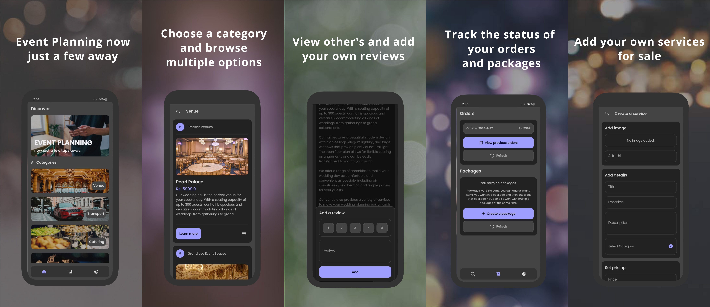

# Event Services Marketplace

An ecommerce application made with Flutter. It is the updated version of my [Sophomore Year Project](https://github.com/mabdullah412/online-event-service-marketplace-flutter).

<!-- TODO: ADD IMAGE HERE -->

## Contents

- [Introduction](https://github.com/mabdullah412/event-services-marketplace/edit/main/README.md#introduction)
- [Features](https://github.com/mabdullah412/event-services-marketplace/edit/main/README.md#features)
- [Working](https://github.com/mabdullah412/event-services-marketplace/edit/main/README.md#working)
- [Try Yourself](https://github.com/mabdullah412/event-services-marketplace/edit/main/README.md#try-yourself)
  - [Download](https://github.com/mabdullah412/event-services-marketplace/edit/main/README.md#download)
  - [Build](https://github.com/mabdullah412/event-services-marketplace/edit/main/README.md#build)

## Introduction

In this modern world of technology, this app is designed to meet the needs of event planning right at the fingertips. It is a mobile-based application for booking event-related services. It allows the users to view, buy and even sell their own services. It offers as a one-stop-shop space for the users to explore through different categories such as venues, catering services, photographers, and transport services, etc.

- This application is only a school project and does not deal with real money.

## Features

- Create account
- Explore services
- Create services
- Add services to cart
- Place order
- Review services
- Sellers can complete orders
- Dark/Light Mode

<!-- TODO: ADD FEATURES IMAGE HERE -->

## Working

This project was divided into 2 subprojects. The application and the server. This repo contains the application. The server is built by me using NodeJS and ExpressJS, and is deployed on vercel. The server repo is not public due to security reasons. The database is hosted on mongodb atlas cluster.

The application uses bloc architecture...

## Try Yourself

You can try the application by running it on your device/emulator. The app communicates with the live server deployed on vercel.

### Download

You can [download](https://github.com/mabdullah412/event-services-marketplace/releases) the installable version of this app for android.

### Build

To clone and run this project, you will need the [Flutter Sdk](https://docs.flutter.dev/get-started/install) installed on your computer.

- Clone the repo
- `flutter pub get` to install packages
- `flutter run` to install and run the app on your device/emulator.
